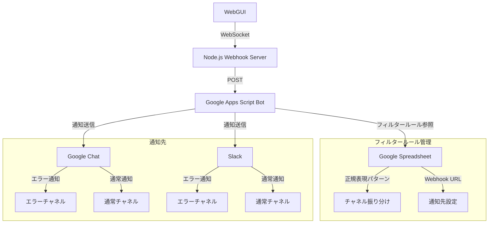

---

この記事は[Zenn](https://zenn.dev/long910/articles/2025-06-07-chat_message_filter)でも公開しています。

# Google Chat と Slack に通知(フィルター付き)を送る Webhook テストシステムの構築

## はじめに

この記事では、システム(テスト用に WebGUI+Node サーバ)から発生したメッセージを Webhook 経由で Google Chat と Slack に送り、内容によって投稿先チャネルを自動で振り分けるシステムの構築方法を紹介します。
※Google Chat は Webhook 生成できなかったため、Slack でのみ検証した。

## システムの概要

- Node.js: Webhook サーバー（メッセージ受信＆Google Apps Script Bot へ転送）
- Google Apps Script: Google Chat Bot（受信した内容でチャネルを振り分けて投稿）
- Google Spreadsheet: フィルタールールの管理
- Slack: 通知用チャネル

## システム構成図



## 1. チャットサービスの設定

### Google Chat のチャネル作成

※ Google Workspace の有料ユーザーのみ利用可能

1. Google Chat にアクセス
2. 左側の「＋」ボタンから「スペースを作成」
3. スペース名（例：エラー通知、通常通知）を入力
4. 「作成」をクリック
5. スペースを開き、「Webhook を追加」で Webhook URL を発行

### Slack のチャネル設定

1. Slack ワークスペースにログイン
2. 通知を送信したいチャネルを作成または選択
3. チャネル名の横の「...」→「チャネルの詳細を表示」
4. 「アプリを追加する」→「Incoming Webhooks」をインストール
5. 「Incoming Webhooks を追加」→「Webhook URL の追加」
6. 生成された Webhook URL をコピー

## 2. Node.js サーバーの構築

### 必要なパッケージのインストール

```bash
npm install express dotenv ws
```

### サーバーコードの実装

https://github.com/long-910/GoogleChatFilter/blob/f65c8695f29553f94e60a55e9a47189594ac21da/index.js

### WebGUI の実装


https://github.com/long-910/GoogleChatFilter/blob/f65c8695f29553f94e60a55e9a47189594ac21da/public/index.html

### 環境変数の設定

`.env`ファイルを作成：

```
BOT_WEBHOOK_URL="<GASのデプロイURL>"
PORT=3000
```

## 3. Google Apps Script Bot の実装

### スプレッドシートの準備

1. 新しい Google Spreadsheet を作成
2. 以下の 2 つのシートを作成：
   - 「フィルター設定」シート
     - A 列: 正規表現パターン
     - B 列: チャネル ID
   - 「チャネル設定」シート
     - A 列: チャネル ID
     - B 列: Google Chat Webhook URL
     - C 列: Slack Webhook URL

### Apps Script コードの実装

https://github.com/long-910/GoogleChatFilter/blob/08f03338dd9e9dab3916768a2757fa8f4664c7f7/Code.gs

### デプロイ手順

1. Google Apps Script エディタで「プロジェクトの設定」を開く
2. 「スクリプトプロパティ」タブを選択
3. 「行を追加」をクリック
4. 以下の設定を追加：
   - プロパティ名: `SPREADSHEET_ID`
   - 値: あなたのスプレッドシート ID
5. 「デプロイ」→「新しいデプロイ」
6. 「種類を選択」で「ウェブアプリ」
7. 「次のユーザーとして実行」→「自分」
8. 「アクセスできるユーザー」→「全員」
9. デプロイして、表示された URL を`.env`の`BOT_WEBHOOK_URL`に設定

## 4. 使い方

### Web ページからメッセージを送信

1. ブラウザで`http://localhost:3000`にアクセス
2. テキストエリアにメッセージを入力
3. 「送信」ボタンをクリック

### API からメッセージを送信

```bash
curl -X POST http://localhost:3000/webhook \
  -H "Content-Type: application/json" \
  -d '{"text": "エラー: サーバーダウン"}'
```

## 5. トラブルシューティング

### 404 エラーが発生する場合

1. Google Chat Webhook URL の場合：

   - Google Workspace の有料ユーザーであることを確認
   - Webhook URL が正しく発行されているか確認
   - スペースの種類が「チャット」であることを確認

2. Slack Webhook URL の場合：

   - Webhook URL が正しく発行されているか確認
   - チャネルが存在するか確認
   - アプリの権限が正しく設定されているか確認

3. Google Apps Script の場合：
   - デプロイが正しく行われているか確認
   - デプロイ URL が正しいか確認
   - アクセス権限が「全員」に設定されているか確認

## 6. 補足

- Google Apps Script の無料枠ではリクエスト数に制限があります
- Google Chat の Webhook 機能は Google Workspace の有料ユーザーのみ利用可能です
- Slack の Webhook は無料プランでも利用可能です
- スプレッドシートの設定を変更することで、フィルタールールを動的に更新できます

## まとめ

このシステムを使用することで、システムからの通知を効率的に管理し、適切なチャネルに振り分けることができます。また、Google Apps Script とスプレッドシートを活用することで、設定の変更も容易に行えます。

## 参考リンク

- [Google Chat API ドキュメント](https://developers.google.com/chat)
- [Slack Incoming Webhooks](https://api.slack.com/messaging/webhooks)
- [Google Apps Script ドキュメント](https://developers.google.com/apps-script)
