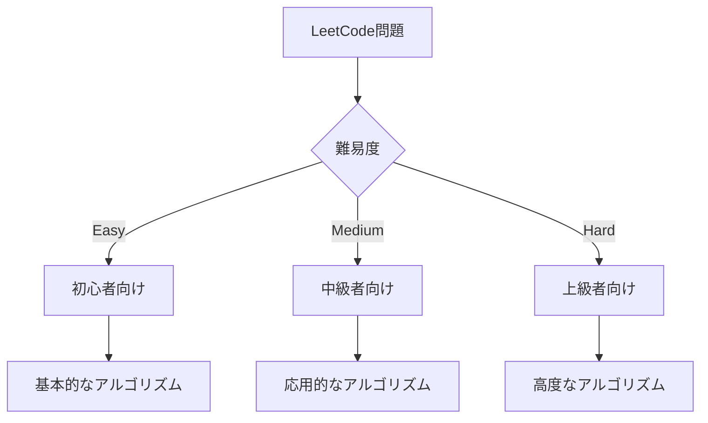
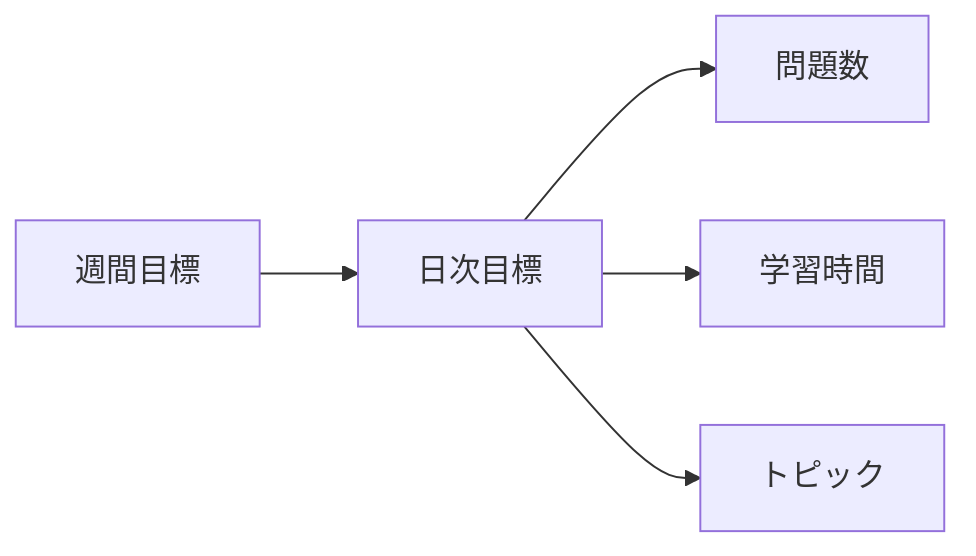

---

この記事は[Zenn](https://zenn.dev/long910/articles/2025-06-09-leetcode_start_guide)でも公開しています。

# LeetCode の始め方と楽しみ方 - プログラミング力向上のための実践ガイド

## はじめに

LeetCode は、プログラミングのスキルを向上させるための人気のプラットフォームです。この記事では、LeetCode を始める方法から、効率的な学習方法、そして継続的に楽しむためのコツまで、詳しく解説していきます。

## LeetCode とは

LeetCode は、以下の特徴を持つプログラミング学習プラットフォームです：

- 2000 以上のアルゴリズム問題
- 実際の企業のコーディング面接で出題された問題
- 複数のプログラミング言語に対応
- 問題の難易度別カテゴリ分け
- コミュニティによるディスカッション機能

## アカウント作成と初期設定

### 1. アカウント作成

1. [LeetCode 公式サイト](https://leetcode.com/)にアクセス
2. 「Sign Up」をクリック
3. メールアドレスまたは GitHub アカウントで登録

### 2. プロフィール設定

- 使用言語の選択（複数選択可能）
- 目標の設定
- 学習時間の設定

## 問題の解き方

### 1. 問題の選び方

#### 推奨される学習順序

1. **Easy 問題から始める**

   - 基本的なデータ構造
   - 単純なアルゴリズム
   - 基本的な制御構造

2. **Medium 問題に挑戦**

   - 複数のアルゴリズムの組み合わせ
   - 最適化が必要な問題
   - 実践的な問題

3. **Hard 問題に挑戦**
   - 高度なアルゴリズム
   - 複雑な問題解決
   - パフォーマンス最適化

### 2. 問題解決のステップ

1. **問題の理解**

   - 入力と出力の確認
   - 制約条件の確認
   - 例題の確認

2. **解法の設計**

   - ブルートフォース解法の検討
   - 最適化の検討
   - 時間・空間計算量の見積もり

3. **コーディング**

   - クリーンなコード作成
   - エッジケースの考慮
   - コメントの追加

4. **テストとデバッグ**
   - サンプルケースのテスト
   - エッジケースのテスト
   - パフォーマンスの確認

## 効率的な学習方法

### 1. 学習計画の立て方

#### 推奨される週間計画

- **初級者**

  - 週 3-4 問（Easy 問題中心）
  - 1 日 30 分-1 時間

- **中級者**

  - 週 5-7 問（Easy/Medium 問題）
  - 1 日 1-2 時間

- **上級者**
  - 週 7-10 問（Medium/Hard 問題）
  - 1 日 2-3 時間

### 2. トピック別学習

1. **基本的なデータ構造**

   - 配列
   - 連結リスト
   - スタック
   - キュー
   - ハッシュテーブル

2. **基本的なアルゴリズム**

   - ソート
   - 検索
   - 再帰
   - 動的計画法

3. **高度なトピック**
   - グラフ理論
   - 文字列操作
   - ビット操作
   - 数学的問題

## モチベーション維持のコツ

### 1. 目標設定

- 短期目標（1 週間）
- 中期目標（1 ヶ月）
- 長期目標（3 ヶ月）

### 2. 進捗管理

- 解いた問題の記録
- 学習時間の記録
- 弱点の分析

### 3. コミュニティの活用

- ディスカッションフォーラムの活用
- 他のユーザーの解法の学習
- コードレビューの参加

## よくある質問と回答

### Q1: どの言語で始めるべきですか？

A: 以下の基準で選択することをお勧めします：

- 最も得意な言語
- 就職・転職で使用予定の言語
- 学習中の言語

### Q2: 1 日どのくらいの時間を費やすべきですか？

A: 以下のような目安をお勧めします：

- 初心者：30 分-1 時間
- 中級者：1-2 時間
- 上級者：2-3 時間

### Q3: 問題が解けない場合はどうすればよいですか？

A: 以下のステップを試してみてください：

1. 問題を完全に理解する
2. 簡単な例で手動で解いてみる
3. ディスカッションフォーラムを確認
4. 解説動画を視聴
5. 翌日再度挑戦

## まとめ

LeetCode は、プログラミングスキルを向上させるための素晴らしいプラットフォームです。この記事で紹介した方法を参考に、自分のペースで学習を進めていきましょう。継続的な学習と実践が、確実なスキル向上につながります。

## 参考リンク

- [LeetCode 公式サイト](https://leetcode.com/)
- [LeetCode Discuss](https://leetcode.com/discuss/)
- [LeetCode Solutions](https://github.com/haoel/leetcode)

## 著者プロフィール

- 名前：XXX
- 経歴：XXX
- LeetCode 実績：XXX 問解決
- 得意分野：XXX
