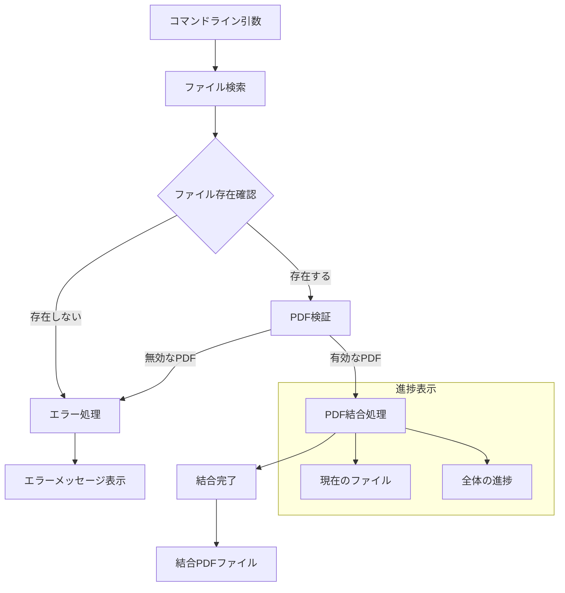

---

この記事は[Zenn](https://zenn.dev/long910/articles/2025-06-09-merge-pdf)でも公開しています。


# PDF ファイル結合ツールの開発とテスト

## はじめに

この記事では、複数の PDF ファイルを簡単に結合するための Python スクリプトの開発について紹介します。  
ワイルドカードパターンを使って、複数の PDF ファイルを一度に結合できるようにしています。  
また、Docker や DevContainer にも対応しており、基本的なテストも実装しています。

### 開発の背景

PDF ファイルの結合は、以下のような場面で頻繁に必要となります：

- 複数のドキュメントを 1 つのファイルにまとめる
- レポートや資料の作成
- スキャンした文書の整理

しかし、既存のツールには以下のような課題がありました：

- 有料ソフトウェアはコストがかかる
- オンラインツールはセキュリティリスクがある
- 大量のファイルを一度に処理できない
- コマンドラインでの自動化が難しい

これらの課題を解決するため、以下の特徴を持つツールの開発を決意しました：

- オープンソースで無料
- ローカル環境で動作
- コマンドラインから使用可能
- 自動化やバッチ処理に対応
- セキュリティを考慮した設計

## システムの概要

このプロジェクトは、以下の機能を提供します：

- 複数の PDF ファイルを 1 つのファイルに結合
- ワイルドカードパターンによるファイル選択
- ファイルの存在確認とエラーハンドリング
- 進捗状況の表示
- Docker と DevContainer 対応
- 基本的な動作確認用のテスト

## 動作の流れ



## 実装コード

実装コードは以下の GitHub リポジトリで公開しています：

https://github.com/long-910/merge_pdf/blob/e864d6d170d7bc4e5c43416a463adc2bfa21cc8b/py_merge_pdf.py

主な実装ポイント：

- pypdf を使用した PDF 操作
- ワイルドカードパターンによるファイル検索
- 進捗表示の実装
- エラーハンドリング
- コマンドライン引数の処理

## 開発環境

- Python 3.6 以上
- pypdf（PDF 操作用ライブラリ）
- Docker（オプション）
- DevContainer（VS Code 拡張機能）

## インストール方法

### ローカル環境でのインストール

1. リポジトリをクローンまたはダウンロードします：

```bash
git clone https://github.com/long-910/merge_pdf.git
cd merge_pdf
```

2. 必要なライブラリをインストールします：

```bash
pip install -r requirements.txt
```

### Docker を使用する場合

1. イメージをビルドします：

```bash
docker build -t pdf-merger .
```

2. コンテナを実行します：

```bash
docker run -v $(pwd):/app pdf-merger "document_*.pdf" -o output.pdf
```

### DevContainer を使用する場合

1. VS Code に「Remote - Containers」拡張機能をインストールします。
2. コマンドパレット（F1）を開き、「Remote-Containers: Reopen in Container」を選択します。
3. コンテナがビルドされ、開発環境が準備されます。

## 使用方法

### 基本的な使用方法

```bash
python py_merge_pdf.py "パターン1" "パターン2" [オプション]
```

### 例

1. 特定のパターンに一致するすべての PDF ファイルを結合：

```bash
python py_merge_pdf.py "document_*.pdf"
```

2. 複数のパターンを指定して結合：

```bash
python py_merge_pdf.py "chapter_*.pdf" "appendix_*.pdf"
```

3. 出力ファイル名を指定：

```bash
python py_merge_pdf.py "*.pdf" -o combined_document.pdf
```

### Docker での使用例

```bash
# カレントディレクトリのPDFファイルを結合
docker run -v $(pwd):/app pdf-merger "*.pdf" -o combined.pdf

# 特定のディレクトリのPDFファイルを結合
docker run -v /path/to/pdfs:/app/pdfs pdf-merger "pdfs/*.pdf" -o pdfs/combined.pdf
```

## テストの実行

### ローカル環境でのテスト実行

```bash
# 基本的な動作確認を実行
python run_tests.py

# 特定のテストを実行
python -m unittest tests/test_pdf_merger.py
```

### Docker でのテスト実行

```bash
# テストを実行
docker run -v $(pwd):/app pdf-merger python run_tests.py
```

## 動作確認項目

以下の項目について基本的な動作確認を行っています：

- PDF ファイルの結合処理
- ファイルが見つからない場合のエラー処理
- 無効な PDF ファイルの処理
- ワイルドカードパターンを使用した結合処理

## 注意事項

- 入力ファイルは必ず PDF 形式である必要があります
- ファイル名に日本語を使用する場合は、システムの文字コード設定に注意してください
- 大量のファイルを結合する場合は、十分なメモリが必要です
- Docker を使用する場合、ボリュームマウントのパスは適切に設定してください

## ライセンス

MIT ライセンス

## 作者

[long-910](https://github.com/long-910)

## 貢献

バグ報告や機能改善の提案は、Issue または Pull Request でお願いします。
