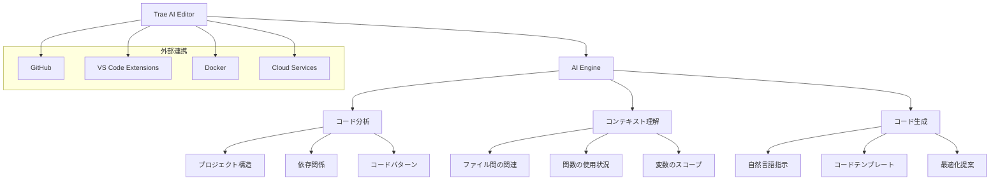

---

この記事は[Zenn](https://zenn.dev/long910/articles/2025-06-21-trae_ai_editor)でも公開しています。


:::message
この記事は Cursor の AI 機能により自動生成されました。
:::

# Trae AI Editor 完全ガイド - 次世代の AI 駆動コードエディタ

## はじめに

Trae AI Editor は、AI 技術を活用した次世代のコードエディタです。従来のエディタとは一線を画す、コンテキスト理解とコード生成能力を備えた開発ツールとして注目を集めています。この記事では、Trae AI Editor の特徴、設定方法、使用方法、そして他の製品との違いについて詳しく解説します。

## Trae AI Editor とは

Trae AI Editor は以下の特徴を持つ革新的なコードエディタです：

- **高度な AI 理解**: プロジェクト全体のコンテキストを理解
- **リアルタイムコード生成**: 自然言語での指示からコードを自動生成
- **インテリジェント補完**: 文脈に応じた高度なコード補完
- **マルチ言語対応**: 主要なプログラミング言語をサポート
- **クラウド同期**: 設定とプロジェクトの同期機能

## システム構成図



## インストールとセットアップ

### 1. ダウンロードとインストール

1. [Trae AI Editor 公式サイト](https://trae.ai)にアクセス
2. オペレーティングシステムに応じたインストーラーをダウンロード
3. インストーラーを実行してセットアップ

### 2. 初期設定

#### アカウント作成

- メールアドレスまたは GitHub アカウントで登録
- 無料プランとプロプランの選択

#### 基本設定

```json
{
  "theme": "dark",
  "fontSize": 14,
  "fontFamily": "JetBrains Mono",
  "tabSize": 2,
  "insertSpaces": true,
  "wordWrap": "on"
}
```

#### AI 設定

- 使用する AI モデルの選択
- コード生成の詳細度設定
- 自動補完の有効/無効

### 3. プロジェクトの初期化

```bash
# 新しいプロジェクトの作成
trae init my-project

# 既存プロジェクトの開く
trae open /path/to/project

# プロジェクト設定の確認
trae config
```

## 基本的な使用方法

### 1. AI アシスタントの活用

#### 自然言語での指示

```
// ユーザーが入力
"ユーザー認証機能を実装して"

// AIが生成するコード
function authenticateUser(email, password) {
  // 認証ロジックの実装
  return validateCredentials(email, password);
}
```

#### コードの説明要求

```
// ユーザーが入力
"この関数の動作を説明して"

// AIが提供する説明
"この関数は配列の要素を昇順にソートし、重複を除去して返します..."
```

### 2. インテリジェント補完

- **関数補完**: 引数の型と説明を表示
- **変数補完**: スコープ内の変数を提案
- **インポート補完**: 必要なモジュールを自動提案
- **エラー修正**: リアルタイムでのエラー検出と修正提案

### 3. コードリファクタリング

```bash
# 選択したコードのリファクタリング
Cmd/Ctrl + Shift + R

# ファイル全体の最適化
Cmd/Ctrl + Shift + O

# 重複コードの検出と統合
Cmd/Ctrl + Shift + D
```

## 高度な機能

### 1. プロジェクト分析


### 2. 自動テスト生成

```javascript
// 元のコード
function add(a, b) {
  return a + b;
}

// AIが生成するテスト
describe("add function", () => {
  test("should add two positive numbers", () => {
    expect(add(2, 3)).toBe(5);
  });

  test("should handle negative numbers", () => {
    expect(add(-1, 1)).toBe(0);
  });
});
```

### 3. ドキュメント自動生成

```javascript
/**
 * @function calculateTotal
 * @description 商品の合計金額を計算する
 * @param {Array} items - 商品の配列
 * @param {number} taxRate - 税率（0-1の範囲）
 * @returns {number} 税込み合計金額
 * @example
 * const items = [{price: 100}, {price: 200}];
 * const total = calculateTotal(items, 0.1);
 * console.log(total); // 330
 */
```

## 他の製品との比較

| 機能             | Trae AI Editor | VS Code + Copilot | Cursor   | JetBrains IDEs |
| ---------------- | -------------- | ----------------- | -------- | -------------- |
| AI 統合レベル    | ⭐⭐⭐⭐⭐     | ⭐⭐⭐            | ⭐⭐⭐⭐ | ⭐⭐           |
| コンテキスト理解 | ⭐⭐⭐⭐⭐     | ⭐⭐⭐            | ⭐⭐⭐⭐ | ⭐⭐           |
| コード生成品質   | ⭐⭐⭐⭐⭐     | ⭐⭐⭐⭐          | ⭐⭐⭐⭐ | ⭐⭐           |
| 学習曲線         | ⭐⭐⭐⭐       | ⭐⭐⭐            | ⭐⭐⭐   | ⭐⭐⭐⭐       |
| カスタマイズ性   | ⭐⭐⭐⭐       | ⭐⭐⭐⭐⭐        | ⭐⭐⭐⭐ | ⭐⭐⭐⭐⭐     |
| パフォーマンス   | ⭐⭐⭐⭐       | ⭐⭐⭐⭐⭐        | ⭐⭐⭐⭐ | ⭐⭐⭐⭐       |
| 価格             | ⭐⭐⭐         | ⭐⭐⭐⭐          | ⭐⭐⭐   | ⭐⭐           |

### 詳細比較

#### VS Code + GitHub Copilot

- **利点**: 豊富な拡張機能、軽量、無料
- **欠点**: AI 機能が限定的、設定が複雑

#### Cursor

- **利点**: 強力な AI 機能、モダンな UI
- **欠点**: 比較的新しい、一部機能が不安定

#### JetBrains IDEs

- **利点**: 成熟した機能、強力なリファクタリング
- **欠点**: 重い、高価、AI 機能が限定的

## 設定のカスタマイズ

### 1. テーマと UI 設定

```json
{
  "workbench.colorTheme": "Trae Dark Pro",
  "editor.fontSize": 16,
  "editor.lineHeight": 1.5,
  "editor.minimap.enabled": true,
  "editor.suggestSelection": "first",
  "editor.acceptSuggestionOnCommitCharacter": false
}
```

### 2. AI 設定の最適化

```json
{
  "trae.ai.model": "gpt-4",
  "trae.ai.temperature": 0.3,
  "trae.ai.maxTokens": 2048,
  "trae.ai.autoComplete": true,
  "trae.ai.codeGeneration": true,
  "trae.ai.explanation": true
}
```

### 3. キーボードショートカット

| 機能                | ショートカット         |
| ------------------- | ---------------------- |
| AI アシスタント起動 | `Cmd/Ctrl + K`         |
| コード生成          | `Cmd/Ctrl + Shift + G` |
| 説明要求            | `Cmd/Ctrl + Shift + E` |
| リファクタリング    | `Cmd/Ctrl + Shift + R` |
| テスト生成          | `Cmd/Ctrl + Shift + T` |

## ベストプラクティス

### 1. 効果的なプロンプト作成

✅ **良い例**:

```
"Reactコンポーネントでユーザープロフィール表示機能を作成。名前、メール、アバター画像を表示し、編集可能にする"
```

❌ **悪い例**:

```
"プロフィール機能を作って"
```

### 2. プロジェクト構造の最適化

- 明確なファイル命名規則
- 適切なディレクトリ構造
- 一貫したコーディング規約

### 3. AI との協働

- 段階的な機能実装
- 定期的なコードレビュー
- 生成されたコードの理解とカスタマイズ

## トラブルシューティング

### よくある問題と解決方法

#### 1. AI 応答が遅い

**原因**: ネットワーク接続、モデルサイズ
**解決方法**:

- ネットワーク接続を確認
- より軽量なモデルに変更
- キャッシュをクリア

#### 2. コード生成品質が低い

**原因**: プロンプトが曖昧、コンテキスト不足
**解決方法**:

- より具体的な指示を提供
- 関連ファイルを開いておく
- プロジェクト構造を整理

#### 3. エディタが重い

**原因**: 大きなファイル、多数の拡張機能
**解決方法**:

- 不要な拡張機能を無効化
- 大きなファイルを分割
- メモリ使用量を監視

## 活用事例

### 事例 1: 新規プロジェクトの立ち上げ

```
1. プロジェクトテンプレートの選択
2. AIによる初期設定の自動化
3. 基本的なファイル構造の生成
4. 開発環境の設定
```

### 事例 2: 既存コードの改善

```
1. コード品質分析の実行
2. 重複コードの検出と統合
3. パフォーマンス最適化の提案
4. セキュリティ脆弱性の修正
```

### 事例 3: チーム開発での活用

```
1. コーディング規約の統一
2. 自動テストの生成
3. ドキュメントの自動更新
4. コードレビューの効率化
```

## 今後の展望

### 予定されている機能

- **音声入力**: 音声での指示入力
- **画像認識**: スクリーンショットからのコード生成
- **リアルタイムコラボレーション**: 複数ユーザーでの同時編集
- **高度なデバッグ**: AI 支援デバッグ機能

### コミュニティへの貢献

- フィードバックの提供
- プラグインの開発
- 使用事例の共有

## まとめ

Trae AI Editor は、AI 技術を活用した次世代のコードエディタとして、開発効率の大幅な向上を実現します。適切な設定と使用方法を理解することで、より効果的に活用できるでしょう。

## 参考リンク

- [Trae AI Editor 公式サイト](https://trae.ai)
- [公式ドキュメント](https://docs.trae.ai)
- [コミュニティフォーラム](https://community.trae.ai)
- [GitHub リポジトリ](https://github.com/trae-ai/editor)
- [チュートリアル動画](https://youtube.com/@trae-ai)
