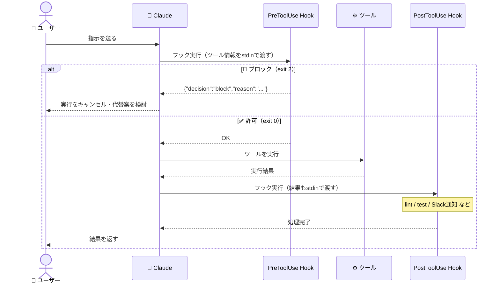

---

この記事は[Zenn](https://zenn.dev/long910/articles/2026-03-13-claude-code-hooks)でも公開しています。


Claude Code がファイルを編集するたびに自動でフォーマッターを走らせたい。危険なコマンドを実行しようとしたときに止めたい。長時間タスクが完了したら Slack に通知してほしい。

こういった「Claude Code の動作に割り込む」ニーズに応えるのが **Hooks** です。

---

## Hooks とは

Hooks は、**Claude Code がツールを呼び出す前後や、セッション終了時などのタイミングで任意のシェルコマンドを実行できる仕組み**です。

シェルスクリプト・Python・Node.js など、実行可能なものなら何でもフックとして使えます。

---

## Hooks のイベントタイプ

| イベント | タイミング | 主な用途 |
|---------|-----------|---------|
| `PreToolUse` | ツール実行の**直前** | 危険なコマンドのブロック・ログ記録 |
| `PostToolUse` | ツール実行の**直後** | テスト自動実行・フォーマット・通知 |
| `Notification` | Claude が通知を送るとき | デスクトップ通知・Slack通知 |
| `Stop` | セッション終了時 | 完了通知・後処理・レポート生成 |



---

## 設定方法

### 設定ファイルの場所

| スコープ | パス |
|---------|------|
| グローバル（全プロジェクト共通） | `~/.claude/settings.json` |
| プロジェクト固有 | `.claude/settings.json` |

プロジェクト設定がグローバル設定を上書きします。

### 基本的な書き方

```json
{
  "hooks": {
    "PostToolUse": [
      {
        "matcher": "Edit",
        "hooks": [
          {
            "type": "command",
            "command": "npm run lint"
          }
        ]
      }
    ]
  }
}
```

`matcher` にはツール名を指定します。`*` でワイルドカード指定も可能です。

### フックへの入力（stdin）

実行されるコマンドの標準入力には、以下の JSON が渡されます：

```json
{
  "session_id": "abc123",
  "tool_name": "Edit",
  "tool_input": {
    "file_path": "/src/app.ts",
    "old_string": "...",
    "new_string": "..."
  }
}
```

`PostToolUse` の場合はさらに `tool_response` フィールドも含まれます。

---

## 実践例

### 1. ファイル編集後に自動でフォーマット・Lint

TypeScript プロジェクトで、Claude がファイルを編集するたびに `eslint --fix` を自動実行する例です。

```json
{
  "hooks": {
    "PostToolUse": [
      {
        "matcher": "Edit",
        "hooks": [
          {
            "type": "command",
            "command": "~/.claude/hooks/auto-format.sh"
          }
        ]
      }
    ]
  }
}
```

```bash
#!/bin/bash
# ~/.claude/hooks/auto-format.sh

# stdin から JSON を読んで編集されたファイルパスを取得
input=$(cat)
file_path=$(echo "$input" | jq -r '.tool_input.file_path // empty')

if [ -z "$file_path" ]; then
  exit 0
fi

# 対象がTypeScriptファイルのときだけlintを実行
if [[ "$file_path" == *.ts || "$file_path" == *.tsx ]]; then
  npx eslint --fix "$file_path" 2>/dev/null
fi
```

`jq` を使って stdin の JSON からファイルパスを取り出し、TypeScript ファイルのときだけ動かしています。

---

### 2. テストの自動実行

テストファイルを書き換えたとき、または対応するソースファイルが変更されたときに自動でテストを実行します。

```json
{
  "hooks": {
    "PostToolUse": [
      {
        "matcher": "Edit",
        "hooks": [
          {
            "type": "command",
            "command": "~/.claude/hooks/run-related-tests.sh"
          }
        ]
      }
    ]
  }
}
```

```bash
#!/bin/bash
# ~/.claude/hooks/run-related-tests.sh

input=$(cat)
file_path=$(echo "$input" | jq -r '.tool_input.file_path // empty')

# テストファイルに関連するテストのみ実行
if [[ "$file_path" == *.test.ts || "$file_path" == *.spec.ts ]]; then
  echo "[Hook] テスト実行: $file_path"
  npx vitest run "$file_path" --reporter=verbose 2>&1 | tail -20
fi
```

大きなプロジェクトではテスト全体を毎回回すと遅いので、変更されたファイルに関連するテストだけを実行するのがポイントです。

---

### 3. 危険なコマンドをブロックする

`PreToolUse` フックで終了コード `2` を返し、かつ標準出力に特定の JSON を出力すると、ツールの実行を**ブロック**できます。

```json
{
  "hooks": {
    "PreToolUse": [
      {
        "matcher": "Bash",
        "hooks": [
          {
            "type": "command",
            "command": "~/.claude/hooks/safety-check.sh"
          }
        ]
      }
    ]
  }
}
```

```bash
#!/bin/bash
# ~/.claude/hooks/safety-check.sh

input=$(cat)
command=$(echo "$input" | jq -r '.tool_input.command // empty')

# 危険なパターンを検出
dangerous_patterns=(
  "rm -rf /"
  "DROP TABLE"
  "DROP DATABASE"
  "> /dev/sda"
)

for pattern in "${dangerous_patterns[@]}"; do
  if echo "$command" | grep -qF "$pattern"; then
    # 終了コード2でブロック
    echo '{"decision": "block", "reason": "危険なコマンドが検出されました: '"$pattern"'"}'
    exit 2
  fi
done

exit 0
```

ブロックされると Claude に理由が伝わり、代替手段を検討し始めます。

---

### 4. タスク完了時に Slack 通知

長時間かかるリファクタリングや大規模な変更が完了したとき、Slack に通知します。

```json
{
  "hooks": {
    "Stop": [
      {
        "matcher": "*",
        "hooks": [
          {
            "type": "command",
            "command": "~/.claude/hooks/notify-slack.sh"
          }
        ]
      }
    ]
  }
}
```

```bash
#!/bin/bash
# ~/.claude/hooks/notify-slack.sh

SLACK_WEBHOOK_URL="${SLACK_WEBHOOK_URL}"

if [ -z "$SLACK_WEBHOOK_URL" ]; then
  exit 0
fi

input=$(cat)
session_id=$(echo "$input" | jq -r '.session_id // "unknown"')

curl -s -X POST "$SLACK_WEBHOOK_URL" \
  -H 'Content-type: application/json' \
  --data "{\"text\": \"✅ Claude Code セッション完了 (session: ${session_id})\"}"
```

Webhook URL は環境変数で管理し、設定ファイルには書かないようにします。

---

### 5. 全操作をログに記録する

Claude Code が何をしたかを後から確認できるよう、すべてのツール呼び出しをログに残します。

```json
{
  "hooks": {
    "PostToolUse": [
      {
        "matcher": "*",
        "hooks": [
          {
            "type": "command",
            "command": "~/.claude/hooks/logger.sh"
          }
        ]
      }
    ]
  }
}
```

```bash
#!/bin/bash
# ~/.claude/hooks/logger.sh

LOG_FILE="$HOME/.claude/logs/tool-usage.jsonl"
mkdir -p "$(dirname "$LOG_FILE")"

# タイムスタンプを付けて追記（1行JSON形式）
cat | jq -c ". + {\"timestamp\": \"$(date -Iseconds)\"}" >> "$LOG_FILE"
```

`.jsonl`（JSON Lines）形式で保存しておくと、後から `jq` や `grep` で絞り込みやすくなります。

```bash
# 今日の Bash コマンドだけ確認
jq 'select(.tool_name == "Bash")' ~/.claude/logs/tool-usage.jsonl | \
  jq -r '[.timestamp, .tool_input.command] | @tsv'
```

---

### 6. デスクトップ通知（macOS）

`Notification` イベントを使うと、Claude Code が「ユーザーの確認が必要」と判断したタイミングでデスクトップ通知を飛ばせます。

```json
{
  "hooks": {
    "Notification": [
      {
        "matcher": "*",
        "hooks": [
          {
            "type": "command",
            "command": "~/.claude/hooks/desktop-notify.sh"
          }
        ]
      }
    ]
  }
}
```

```bash
#!/bin/bash
# ~/.claude/hooks/desktop-notify.sh (macOS)

input=$(cat)
message=$(echo "$input" | jq -r '.message // "Claude Codeから通知があります"')

osascript -e "display notification \"$message\" with title \"Claude Code\""
```

Linux の場合は `notify-send` が使えます：

```bash
notify-send "Claude Code" "$message"
```

---

## プロジェクト別の設定例

プロジェクトごとに異なるルールを適用したい場合は、`.claude/settings.json` に置きます。

```
my-project/
├── .claude/
│   ├── settings.json    ← このプロジェクト専用の Hooks 設定
│   └── hooks/
│       ├── lint.sh
│       └── test.sh
├── src/
└── ...
```

```json
// my-project/.claude/settings.json
{
  "hooks": {
    "PostToolUse": [
      {
        "matcher": "Edit",
        "hooks": [
          {
            "type": "command",
            "command": ".claude/hooks/lint.sh"
          }
        ]
      }
    ],
    "Stop": [
      {
        "matcher": "*",
        "hooks": [
          {
            "type": "command",
            "command": ".claude/hooks/test.sh"
          }
        ]
      }
    ]
  }
}
```

チームで共有するプロジェクト設定は `.claude/settings.json` をリポジトリにコミットしておくと、メンバー全員に同じフックが適用されます。

:::message alert
**セキュリティの注意：** フックスクリプトにAPIキーやパスワードを直接書かないようにしてください。シークレットは環境変数（`~/.zshrc` や `~/.zshrc.local`）で管理し、スクリプト内では `$SLACK_WEBHOOK_URL` のように参照するのがベストプラクティスです。
:::

---

## フックのデバッグ方法

フックが期待通り動かないときの確認方法です。

### ログを出力して動作確認

```bash
#!/bin/bash
# デバッグ用：受け取った入力を確認
input=$(cat)
echo "[DEBUG] $(date): $input" >> /tmp/claude-hook-debug.log
```

### 終了コードに注意

| 終了コード | 動作 |
|-----------|------|
| `0` | 正常終了。ツール実行は継続 |
| `2` + 特定の JSON 出力 | ツールの実行をブロック |
| その他の非ゼロ | エラーとして扱われるが、ツール実行は継続 |

`PreToolUse` でブロックしたい場合は、終了コード `2` と合わせて以下を標準出力に出力します：

```json
{"decision": "block", "reason": "ブロックの理由"}
```

---

## よくある使い方まとめ

```
ファイル編集後にフォーマット → PostToolUse + Edit + prettier/eslint
テスト自動実行           → PostToolUse + Edit + vitest/jest
危険コマンドのブロック    → PreToolUse + Bash + パターンマッチ
完了通知（Slack/LINE）   → Stop + curl
デスクトップ通知         → Notification + osascript/notify-send
操作ログの記録           → PostToolUse + * + JSONL追記
```

---

## まとめ

Hooks を使うと、Claude Code を「コードを書くだけのツール」から「チームのワークフローに組み込まれたエージェント」に格上げできます。

| ポイント | 内容 |
|---------|------|
| **設定場所** | `~/.claude/settings.json`（グローバル）or `.claude/settings.json`（プロジェクト） |
| **主なイベント** | PreToolUse / PostToolUse / Notification / Stop |
| **入力形式** | stdin に JSON が渡される（`jq` で解析） |
| **ブロック方法** | 終了コード `2` + `{"decision": "block", "reason": "..."}` |
| **おすすめ用途** | フォーマット自動化・テスト実行・完了通知・セキュリティチェック |

最初の一歩として、`PostToolUse` + `Edit` でフォーマッターを自動実行するだけでも、かなりの作業削減になります。ぜひ試してみてください。

---

## 参考リンク

- [Claude Code 公式ドキュメント - Hooks](https://docs.anthropic.com/ja/docs/claude-code/hooks)
- [Claude Code のSkillで自作スラッシュコマンドを作ろう](https://zenn.dev/long910/articles/2026-02-23-claude-code-skills)
- [Claude Code のAgent Teamsで複数AIが協調するチームを作ろう](https://zenn.dev/long910/articles/2026-02-23-claude-code-agent-teams)
- [MCP（Model Context Protocol）入門](https://zenn.dev/long910/articles/2026-02-22-mcp-introduction)

