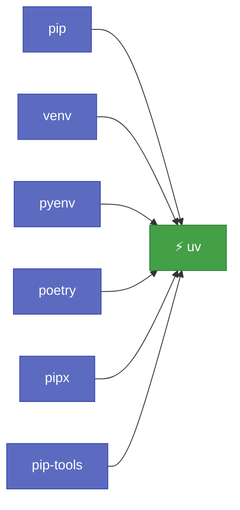
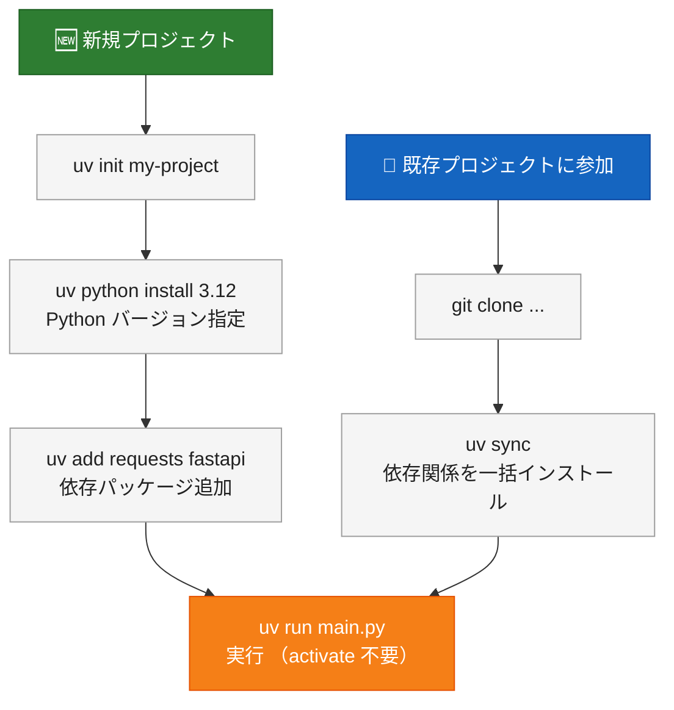

---

この記事は[Zenn](https://zenn.dev/long910/articles/2026-03-13-uv-python)でも公開しています。


Python の開発環境構築といえば、`pip`・`venv`・`poetry`・`pyenv` をそれぞれ使い分けるのが長年の常識でした。

それを**ひとつのツールで全部やってしまおう**というのが **uv** です。

---

## uv とは

[uv](https://docs.astral.sh/uv/) は、Rust 製の Python パッケージマネージャー・プロジェクト管理ツールです。`ruff`（Python 向け超高速 Linter）と同じ **Astral** チームが開発しています。

### uv が置き換えるもの

| 従来のツール | 用途 | uv での代替 |
|------------|------|------------|
| `pip` | パッケージのインストール・管理 | `uv pip install` |
| `venv` / `virtualenv` | 仮想環境の作成・管理 | `uv venv` |
| `pip-tools` | 依存関係のロックファイル生成 | `uv pip compile` |
| `pipx` | CLI ツールの独立インストール | `uv tool install` |
| `pyenv` | Python バージョンの切り替え・管理 | `uv python install` |
| `poetry` / `hatch` | プロジェクト管理・パッケージビルド | `uv init` / `uv add` |

これらをひとつのバイナリにまとめ、**依存関係の解決速度は pip の 10〜100倍以上** を実現しています。



---

## インストール

```bash
# macOS / Linux
curl -LsSf https://astral.sh/uv/install.sh | sh

# Windows（PowerShell）
powershell -ExecutionPolicy ByPass -c "irm https://astral.sh/uv/install.ps1 | iex"

# Homebrew（macOS / Linux）
brew install uv

# pip 経由（既存環境があれば）
pip install uv
```

インストール後、シェルを再起動するか `source ~/.zshrc` を実行します。

```bash
uv --version
# uv 0.6.x (...)
```

---

## Python バージョン管理（pyenv の代替）

### Python のインストール

```bash
# 最新の安定版 Python をインストール
uv python install

# バージョンを指定してインストール
uv python install 3.12
uv python install 3.11 3.12 3.13

# インストール済みの Python 一覧
uv python list
```

pyenv と違い、別途シェルへの設定追記は不要です。uv が自動的に管理します。

### Python バージョンの切り替え

```bash
# プロジェクトで使う Python バージョンを固定
uv python pin 3.12

# → .python-version ファイルが作成される
```

---

## プロジェクト管理（poetry の代替）

### 新規プロジェクトの作成

```bash
uv init my-project
cd my-project
```

以下のファイルが生成されます：

```
my-project/
├── .python-version   # Python バージョン
├── pyproject.toml    # プロジェクト設定・依存関係
├── uv.lock           # ロックファイル（自動生成）
├── README.md
└── hello.py
```

`pyproject.toml` の中身：

```toml
[project]
name = "my-project"
version = "0.1.0"
description = "Add your description here"
readme = "README.md"
requires-python = ">=3.12"
dependencies = []
```

### 依存パッケージの追加・削除

```bash
# パッケージを追加（pyproject.toml に自動反映）
uv add requests
uv add fastapi uvicorn

# バージョン指定
uv add "django>=5.0"

# 開発用依存として追加
uv add --dev pytest ruff mypy

# パッケージを削除
uv remove requests
```

`poetry add` と同じ感覚で使えます。`uv.lock` も自動更新されます。

### 依存関係の同期

```bash
# pyproject.toml に基づいて仮想環境を同期
uv sync

# 開発用依存も含めて同期
uv sync --dev
```

`git clone` 後は `uv sync` だけで環境が整います。

### 典型的なプロジェクト立ち上げの流れ



---

## スクリプト実行（仮想環境なしで使う）

### uv run

```bash
# 仮想環境を明示的に activate せずに実行
uv run python main.py
uv run pytest
uv run ruff check .
```

`.venv` がない場合は自動作成して実行してくれます。`source .venv/bin/activate` が不要になります。

### インラインスクリプト依存（PEP 723）

スクリプトの先頭に依存関係を書いておくと、uv が自動でインストールして実行してくれます。

```python
#!/usr/bin/env -S uv run
# /// script
# dependencies = [
#   "requests",
#   "rich",
# ]
# ///

import requests
from rich import print

response = requests.get("https://api.github.com")
print(response.json())
```

```bash
uv run fetch.py
# → requests と rich を自動インストールして実行
```

インストール済みのライブラリをチェックする必要がなく、スクリプト単体で配布できます。

---

## pip の代替（既存プロジェクトや移行期に）

既存の `pip` コマンドはほぼそのまま `uv pip` に置き換えられます。

```bash
# インストール
uv pip install requests
uv pip install -r requirements.txt

# アンインストール
uv pip uninstall requests

# 一覧
uv pip list
uv pip freeze

# 依存関係のコンパイル（pip-tools の代替）
uv pip compile requirements.in -o requirements.txt
```

---

## CLI ツール管理（pipx の代替）

グローバルにインストールしたい CLI ツール（`ruff`・`httpie`・`black`など）は `uv tool` で管理します。

```bash
# インストール
uv tool install ruff
uv tool install httpie

# 一時実行（インストールせずに使う）
uvx ruff check .
uvx black .

# 一覧
uv tool list

# アップデート
uv tool upgrade ruff
uv tool upgrade --all
```

`uvx` は `uv tool run` のショートカットです。インストールなしでツールを試せるので便利です。

---

## 既存プロジェクトへの移行

### pip + requirements.txt から移行

```bash
# 既存ディレクトリで初期化
uv init --no-package

# requirements.txt から依存関係をインポート
uv add $(cat requirements.txt)

# または pip compile でロックファイルを生成
uv pip compile requirements.txt -o requirements.lock
```

### poetry から移行

```bash
# pyproject.toml がある場合は uv がそのまま認識する
uv sync

# poetry.lock → uv.lock に変換
uv lock
```

---

## CI/CD での使い方

### GitHub Actions

```yaml
- name: Set up Python with uv
  uses: astral-sh/setup-uv@v5
  with:
    python-version: "3.12"

- name: Install dependencies
  run: uv sync --dev

- name: Run tests
  run: uv run pytest
```

`setup-uv` アクションが公式に提供されており、キャッシュも自動で管理されます。

---

## 速度の実感

[uv 公式 GitHub README のベンチマーク](https://github.com/astral-sh/uv?tab=readme-ov-file#benchmarks)より、`trio` パッケージをキャッシュなしでインストールした場合の計測値です。

| ツール | インストール時間 | pip 比（速度） |
|-------|---------------|-------------|
| pip | 約 11.2 秒 | 1× |
| poetry | 約 15.0 秒 | 0.75×（pip より遅い） |
| **uv** | **約 0.3 秒** | **約 37×（pip より速い）** |

キャッシュありだとさらに速く、ほぼ一瞬で完了します。大規模プロジェクトや CI の実行時間削減に大きく効きます。

---

## よくある疑問

### Q. poetry を使い続けても問題ない？

問題ありません。ただ、uv は poetry が提供するほぼすべての機能を内包しており、速度も大幅に上回ります。新規プロジェクトなら uv を選ぶ理由は十分にあります。

### Q. uv.lock は git 管理すべき？

**はい、コミットすべきです。** `uv.lock` はチームメンバーや CI が同一の環境を再現するための保証です。`poetry.lock` や `package-lock.json` と同じ位置づけです。

### Q. 仮想環境の場所は？

デフォルトではプロジェクトルートの `.venv/` に作成されます。グローバルに管理したい場合は `UV_PROJECT_ENVIRONMENT` 環境変数で変更できます。

### Q. Python のシステムインストールと競合しない？

uv が管理する Python は `~/.local/share/uv/python/` に独立して配置されるため、システムの Python と競合しません。

---

## まとめ

| できること | コマンド |
|----------|---------|
| Python インストール | `uv python install 3.12` |
| プロジェクト作成 | `uv init` |
| パッケージ追加 | `uv add requests` |
| 依存関係の同期 | `uv sync` |
| スクリプト実行 | `uv run main.py` |
| CLI ツール管理 | `uv tool install ruff` |
| pip の代替 | `uv pip install ...` |

Python 開発のセットアップが、`curl ... | sh` と `uv sync` の2ステップで完結するようになります。まずは `uv python install` と `uv init` から試してみてください。

---

## 参考リンク

- [uv 公式ドキュメント](https://docs.astral.sh/uv/)
- [uv GitHub リポジトリ](https://github.com/astral-sh/uv)
- [astral-sh/setup-uv（GitHub Actions）](https://github.com/astral-sh/setup-uv)
- [PEP 723 – Inline script metadata](https://peps.python.org/pep-0723/)
