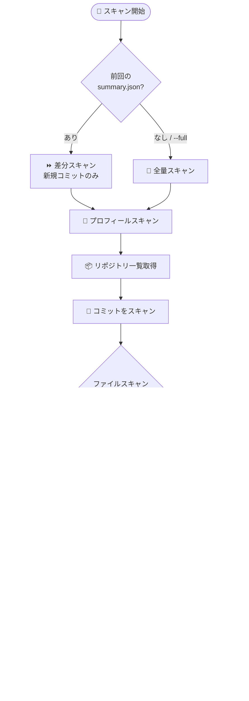

---

この記事は[Zenn](https://zenn.dev/long910/articles/2026-03-29-github-leak-check)でも公開しています。


## きっかけ

「メールアドレスを非公開設定にしているのに、GitHub 関連の迷惑メールが増えた気がする…」

そんな疑問から調べてみると、GitHub の **"Keep my email addresses private"** 設定は**今後のコミットにしか適用されない**ことが分かりました。過去のコミットや他のサービスから移行したリポジトリには、本物のメールアドレスがそのまま残り続けます。

スパムボットは GitHub のコミット API を常時クロールしているため、どこか 1 つのコミットにアドレスが含まれているだけで、すぐに収集されてしまいます。

そこで GitHub アカウント全体を自動でスキャンして漏洩を検出するツール **[github-leak-check](https://github.com/long-910/github_leak_check)** を作りました。

---

## よくある漏洩パターン

| パターン | 原因 |
|---|---|
| 古いコミット | 設定を有効にする前、またはローカルの `git config` に本物のアドレスが残ったまま |
| 強制プッシュ / rebase | 履歴を書き換えても、古い author メタデータが commit オブジェクトに含まれたまま再公開される |
| 他サービスからの移行 | 別ホスティングから持ってきたリポジトリに元のアドレスが全コミットに残っている |
| 公開プロフィール | プロフィールのメールフィールドは誰でも閲覧でき、スクレイピングの対象になりやすい |
| ソースファイル | `package.json` や README、`.mailmap` などにメールアドレスを直接記載している |

---

## このツールでできること

| # | 機能 | 説明 |
|---|---|---|
| 1 | **コミットスキャン** | 全リポジトリの `author.email` と `committer.email` を確認 |
| 2 | **ファイルスキャン** | README・package.json・pyproject.toml などからメールアドレスを検索 |
| 3 | **プロフィールスキャン** | 公開プロフィールにメールアドレスが設定されていないか確認 |
| 4 | **スマートフィルタ** | `@users.noreply.github.com` 系以外のアドレスを漏洩として検出 |
| 5 | **差分スキャン** | 2 回目以降は前回スキャン以降の新規コミットのみを対象に（高速化） |
| 6 | **フォーク除外** | デフォルトでフォークリポジトリをスキップ（`--include-forks` で含めることも可） |
| 7 | **プロフィールバッジ** | 結果をリアルタイムバッジとして GitHub プロフィールに表示 |

---

## GitHub Action として使う（推奨）

ローカル環境は不要です。Fork → Secret 登録 → 完了、の 3 ステップで毎日自動スキャンが走ります。

### ステップ 1 — Fork する

リポジトリ右上の **Fork** をクリックします。

### ステップ 2 — PAT を Secret として登録する

Fine-grained PAT を作成し（必要権限：Contents・Metadata・Email addresses、いずれも読み取り）、フォークしたリポジトリの **Settings → Secrets and variables → Actions** に `GH_PAT` として登録します。

### ステップ 3 — Actions を有効化してバッジを埋め込む

Fork の **Actions** タブを開いてワークフローを有効化します。`main` への push 時と毎日 03:00 UTC に自動スキャンが実行されます。

プロフィール README にライブバッジを埋め込む場合：

```markdown

```

バッジの見た目は以下の 4 種類です。

| CLEAN | LEAKS FOUND | RATE LIMITED | ERROR |
|:---:|:---:|:---:|:---:|
|  |  |  |  |

---

## 他のリポジトリのワークフローに組み込む

GitHub Marketplace でも公開しています。任意のリポジトリに 2 行で組み込めます。

```yaml
- uses: actions/checkout@v4

- name: メール漏洩スキャン
  uses: long-910/github_leak_check@v1
  with:
    github-token: ${{ secrets.GH_PAT }}
```

### 主な入力パラメータ

| パラメータ | デフォルト | 説明 |
|---|---|---|
| `github-token` | — | PAT（必須） |
| `target-emails` | すべて | 監視するアドレス（カンマ区切り） |
| `max-commits` | `500` | リポジトリごとの最大スキャンコミット数 |
| `include-forks` | `false` | フォークリポジトリも含める |
| `no-files` | `false` | ファイルスキャンをスキップ |
| `full-scan` | `false` | 前回スキャンを無視して全量スキャン |

### 出力

| 出力 | 説明 |
|---|---|
| `status` | `CLEAN` / `LEAKS_FOUND` / `RATE_LIMITED` / `ERROR` |
| `leak-count` | 検出した漏洩の件数 |
| `exit-code` | `0` クリーン・`1` 漏洩あり・`2` レート制限 |

---

## 動作の仕組み



出力ファイルは 3 種類です。

```
results/
├── summary.json   ← 集計のみ（実アドレスなし、コミット対象）
├── card.svg       ← プロフィール埋め込み用バッジ（コミット対象）
└── leaks.json     ← 詳細データ（.gitignore 済み、コミットされない）
```

`leaks.json` には実際のメールアドレスが含まれるため、`.gitignore` でリポジトリにコミットされないよう設計しています。

---

## 漏洩が見つかったときの対処法

### まず新たな漏洩を止める

1. **GitHub Settings → Emails** で以下を有効化：
   - "Keep my email addresses private"
   - "Block command line pushes that expose my email"

2. **ローカルの `git config` を更新**：
   ```bash
   git config --global user.email "ID+USERNAME@users.noreply.github.com"
   ```

### 漏洩の場所ごとの対処

**プロフィール漏洩** → GitHub Settings → Profile → Public email を "Don't show my email address" に変更

**ファイル内容の漏洩** → `fix.py` で対話的に置換：
```bash
python fix.py
git add . && git commit -m "fix: replace leaked email" && git push
```

**コミット履歴の漏洩** → 2 つの方法があります：

| 方法 | 内容 | 向いている状況 |
|---|---|---|
| **`.mailmap`** | `git log` 等の表示を上書き（commit オブジェクトは変更なし） | チームリポジトリ・アーカイブ済み |
| **`git filter-repo`** | commit を完全に書き換え（破壊的・要バックアップ） | 個人リポジトリ・共同作業者なし |

```bash
# .mailmap による安全な方法
python fix.py
git add .mailmap && git commit -m "chore: add mailmap" && git push

# git filter-repo による完全な書き換え
python fix.py --rewrite
git push --force-with-lease origin main
```

### 修正を確認する

```bash
GH_PAT=ghp_... python scan.py YOUR_USERNAME --full --email your@real.address
```

---

## ローカルで実行する（上級者・デバッグ向け）

```bash
pip install -r requirements.txt

# 前回スキャン以降のコミットをスキャン（デフォルト）
GH_PAT=ghp_... python scan.py YOUR_USERNAME

# 全量スキャン
GH_PAT=ghp_... python scan.py YOUR_USERNAME --full

# 特定のアドレスのみを検出
GH_PAT=ghp_... python scan.py YOUR_USERNAME --email your@example.com

# フォークも含める
GH_PAT=ghp_... python scan.py YOUR_USERNAME --include-forks
```

---

## 安全と判定されるパターン

以下のアドレスは漏洩として報告されません。

| パターン | 例 |
|---|---|
| `@users.noreply.github.com` | `12345+user@users.noreply.github.com` |
| `noreply@github.com` | `noreply@github.com` |
| `[bot]@` | `dependabot[bot]@users.noreply.github.com` |
| `@noreply.github.com` | `actions@noreply.github.com` |

---

## 免責事項

:::message alert
本ツールはベストエフォートでの検出を行うものです。スキャン結果の完全性・正確性を保証するものではありません。また、`git filter-repo` による履歴書き換えや `--force-with-lease` によるプッシュは**元に戻せない破壊的な操作**です。実行前には必ずリポジトリのバックアップを取り、十分に内容を確認してください。**あくまで自己責任でご使用ください。**
:::

## まとめ

- GitHub の "メールを非公開にする" 設定だけでは**過去のコミット履歴は保護されない**
- スパムボットはコミット API を常時クロールしており、1 件の漏洩が迷惑メールの原因になる
- **github-leak-check** を Fork して PAT を登録するだけで、毎日自動スキャンが走り、プロフィールにリアルタイムバッジが表示される
- 漏洩が見つかっても `fix.py` で `.mailmap` 生成や `git filter-repo` による完全書き換えまで対応できる

リポジトリはこちらです。GitHub Marketplace からも利用できます。

https://github.com/long-910/github_leak_check
